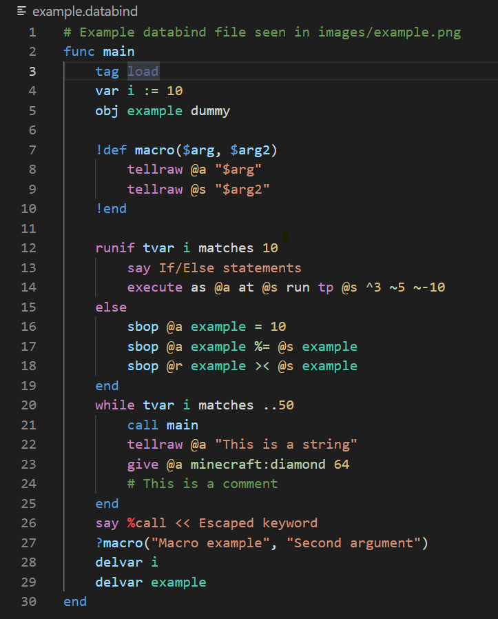

# Databind Syntax Highlighter

A Visual Studio Code syntax highlighter extension for [MysteryBlokHed's](https://www.github.com/MysteryBlokHed/databind) databind language.

Syntax highlighter created by [Supercam19](https://www.github.com/supercam19).

NOTICE: This extension is early in development.

## Features

- Syntax highlighting for most of Databinds features
- Syntax highlighting for strings
- Syntax highlighting for comments
- Syntax highlighting for some mcfunction features
- Auto-closing symbols such as: "", {}, etc...

## Installation

### Automatic

Download the extension from the [VS Code marketplace](https://marketplace.visualstudio.com/items?itemName=supercam19.language-databind&ssr=false#overview) or search `databind` in the the extension tab of the VS Code app.

### Manual

1. Clone the repository or download and extract the zip
2. Put the extension folder in your /Users/[USERNAME]/.vscode/extenstions folder
3. Reload VS Code

